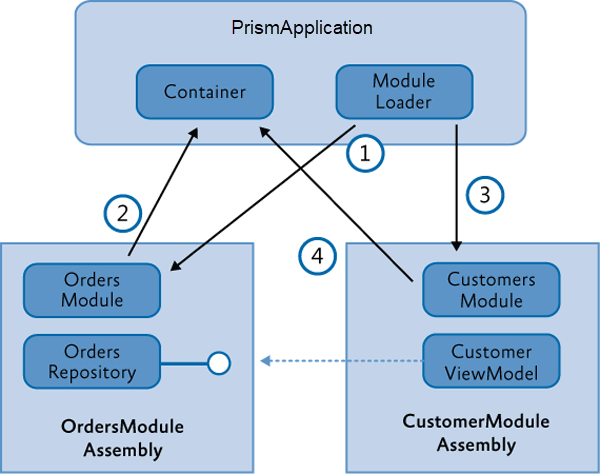

# 使用 Prism 库进行模块化应用程序开发

模块化应用程序是划分为一组松散耦合的功能单元（命名模块）的应用程序，这些功能单元可以集成到更大的应用程序中。客户端模块封装了应用程序整体功能的一部分，通常表示一组相关关注点。它可以包括相关组件的集合，例如应用程序功能（包括用户界面和业务逻辑），也可以包括应用程序基础结构（例如用于记录或验证用户身份的应用程序级服务）。模块彼此独立，但可以以松耦合的方式相互通信。使用模块化应用程序设计可以更轻松地开发、测试、部署和维护应用程序。

例如，考虑个人银行应用程序。用户可以访问各种功能，例如在账户之间转账、支付账单以及从单个用户界面 （UI） 更新个人信息。然而，在幕后，这些功能中的每一个都封装在一个离散的模块中。这些模块相互通信，并与后端系统（如数据库服务器和 Web 服务）通信。应用程序服务将各种组件集成到每个不同的模块中，并处理与用户的通信。用户看到的是一个看起来像单个应用程序的集成视图。

下图显示了具有多个模块的模块化应用程序的设计。


## 构建模块化应用程序的好处

您可能已经在使用程序集、接口和类构建架构良好的应用程序，并采用良好的面向对象设计原则。即便如此，除非非常小心，否则您的应用程序设计可能仍然是“整体式”的（所有功能在应用程序中以紧密耦合的方式实现），这可能会使应用程序难以开发、测试、扩展和维护。

另一方面，模块化应用程序方法可以帮助您识别应用程序的大规模功能区域，并允许您独立开发和测试该功能。这可以使开发和测试更容易，但也可以使您的应用程序更灵活，更容易在将来扩展。模块化方法的好处是，它可以使整个应用程序体系结构更加灵活和可维护，因为它允许您将应用程序分解为可管理的部分。每个部分都封装了特定的功能，每个部分都通过清晰但松散耦合的通信渠道进行集成。

## Prism 对模块化应用开发的支持

Prism 为模块化应用程序开发和应用程序中的运行时模块管理提供支持。使用 Prism 的模块化开发功能可以节省您的时间，因为您不必实施和测试自己的模块化框架。Prism 支持以下模块化应用程序开发功能：

- 用于注册命名模块和每个模块位置的模块目录;您可以通过以下方式创建模块目录：
  - 通过在代码或可扩展应用程序标记语言 （XAML） 中定义模块
  - 通过发现目录中的模块，这样您就可以加载所有模块，而无需在集中式目录中显式定义
  - 通过在配置文件中定义模块
  - 模块的声明性元数据属性，以支持初始化模式和依赖项
- 对于模块加载：
  - 依赖关系管理，包括重复和周期检测，以确保模块以正确的顺序加载，并且只加载和初始化一次
  - 模块的按需和后台下载，以最大限度地减少应用程序启动时间;其余模块可以在后台或需要时加载和初始化
- 与依赖注入容器集成，支持模块之间的松耦合

## 核心概念

本节介绍 Prism 中与模块化相关的核心概念，包括 ```IModule``` 接口、模块加载过程、模块目录、模块之间的通信以及依赖注入容器。

### IModule：模块化应用程序的构建块

模块是功能和资源的逻辑集合，其打包方式可以单独开发、测试、部署和集成到应用程序中。包可以是一个或多个程序集。每个模块都有一个中心类，该类负责初始化模块并将其功能集成到应用程序中。该类实现 ```IModule``` 接口.

_**注意:** 一个实现了  ```IModule``` 接口的类的存在就足以将该包识别为一个模块。_

```IModule``` i接口有两个方法，分别是 ```OnInitialized``` 和 ```RegisterTypes```。两者都引用依赖注入容器作为参数。当模块加载到应用程序中时， ```RegisterTypes``` 首先调用，并应用于注册模块实现的任何服务或功能。接下来，调用该 ```OnInitialized``` 方法。在这里，应该执行视图注册或任何其他模块初始化代码之类的操作。

```cs
public class MyModule : IModule
{
    public void RegisterTypes(IContainerRegistry containerRegistry)
    {
        // register with the container that SomeService implements ISomeService
        // ISomeService is defined in the Infrastructure module, see app architecture diagram
        containerRegistry.Register<MyApplication.Infrastructure.ISomeService, SomeService>();
    }

    public void OnInitialized(IContainerProvider containerProvider)
    {
        // use the containerProvider to retrieve the instance of the Prism RegionManager
        // and register the view in this module with a specific region in the app
        var regionManager = containerProvider.Resolve<IRegionManager>();
        regionManager.RegisterViewWithRegion("MyModuleView", typeof(Views.ThisModuleView));
    }
}
```

### 模块生命周期

Prism 中的模块加载过程包括以下顺序：

- **注册** 模块是通过在类中实现 IModule 接口来创建的。
- **发现模块**。 要在运行时为特定应用程序加载的模块在模块目录中定义。该目录包含有关要加载的模块的信息，例如它们的位置以及要加载的顺序。
- **加载模块**。 包含模块的程序集将加载到内存中。
- **初始化模块**。 然后初始化模块。这意味着创建模块类的实例并调用其中的 ```RegisterTypes``` 和 ```OnInitialized``` 方法通过 ```IModule``` 接口。


### 模块目录

```ModuleCatalog``` 包含有关应用程序可以使用的模块的信息。目录实质上是类的 ```ModuleInfo``` 集合。每个模块都在一个 ```ModuleInfo``` 类中描述，该类记录了模块的名称、类型和位置以及其他属性。有几种典型的方法可以用 **ModuleInfo** 实例填充 **ModuleCatalog** :

- 在代码中注册模块
- 在 XAML 中注册模块
- 在配置文件中注册模块
- 寻找本地磁盘目录中的模块

应使用的注册和发现机制取决于应用程序的需求。使用配置文件或 XAML 文件，应用程序不需要引用模块。使用目录可以允许应用程序发现模块，而无需在文件中指定它们。

### 控制何时加载模块

Prism 应用程序可以尽快初始化模块（称为“可用时”），或者在应用程序需要它们时（称为“按需”）。请考虑以下加载模块的准则：

- 应用程序运行所需的模块必须与应用程序一起加载，并在应用程序运行时初始化。
- 包含很少使用的功能的模块（或者是其他模块可选依赖的支持模块）可以按需加载和初始化。

考虑如何对应用程序进行分区、常见使用方案和应用程序启动时间，以确定如何配置应用程序进行初始化。

### 将模块与应用程序集成

每个 ```Prism.DryIoc.[Platform]``` 和 ```Prism.Unity.[Platform]``` 程序集都提供一个 ```Application``` 基类，该类用作 App 类的基类。重写虚拟方法 ```CreateModuleCatalog``` 以创建所需类型的模块目录。

于应用中的每个模块，实现用于注册模块类型和服务的 ```IModuleInfo``` 接口。以下是将模块集成到应用中的常见操作：

- 将模块的视图添加到应用程序的导航结构中。在使用视图发现或视图注入生成复合 UI 应用程序时，这很常见。
- 订阅应用程序级事件或服务。
- 将共享服务注册到应用程序的依赖项注入容器。

### 模块之间的通信

尽管模块之间应该具有低耦合，但模块之间相互通信是很常见的。有几种松散耦合的沟通模式，每种模式都有自己的优势。通常，这些模式的组合用于创建生成的解决方案。以下是其中一些模式：

- **松散耦合事件**。一个模块可以广播某个事件已经发生。其他模块可以订阅这些事件，以便在事件发生时收到通知。松散耦合事件是在两个模块之间建立通信的轻量级方式;因此，它们很容易实现。但是，过于依赖事件的设计可能变得难以维护，尤其是在必须将许多事件编排在一起才能完成单个任务时。在这种情况下，最好考虑共享服务。
- **共享服务**。共享服务是可以通过公共接口访问的类。通常，共享服务位于共享程序集中，并提供系统范围的服务，例如身份验证、日志记录或配置。
- **共享资源**。如果不希望模块之间直接通信，也可以让它们通过共享资源（如数据库或一组 Web 服务）间接通信。

### 依赖注入和模块化应用程序

**Unity** 和 **DryIoc** 等容器允许您轻松使用控制反转 （IoC） 和依赖关系注入，它们是强大的设计模式，有助于以松散耦合的方式组合组件。它允许组件获取对它们所依赖的其他组件的引用，而无需对这些引用进行硬编码，从而促进更好的代码重用和更高的灵活性。在构建松散耦合的模块化应用程序时，依赖注入非常有用。Prism 被设计为与用于在应用程序中组合组件的依赖注入容器无关。

无论选择三个容器中的哪一个，Prism 都将使用该容器来构建和初始化每个模块，以便它们保持松散耦合。

## 关键决策

您将做出的第一个决定是是否要开发模块化解决方案。如上一节所述，构建模块化应用程序有许多好处，但要获得这些好处，您需要付出时间和精力。如果您决定开发模块化解决方案，还需要考虑以下几点：

- **确定将使用的框架**。您可以创建自己的模块化框架，使用 Prism 或其他框架。
- **确定如何组织解决方案**。通过定义每个模块的边界（包括每个模块的一部分）来接近模块化体系结构。您可以决定使用模块化来简化开发，并控制应用程序的部署方式或是否支持插件或可扩展体系结构。
- **确定如何对模块进行分区**。模块可以根据需求进行不同的分区，例如，按功能区域、提供程序模块、开发团队和部署要求进行分区。
- **确定应用程序将向所有模块提供的核心服务**。例如，核心服务可以是错误报告服务，也可以是身份验证和授权服务。
- **如果您使用的是 Prism，请确定使用哪种方法在模块目录中注册模块**。对于 WPF，可以在代码、XAML 中、配置文件中注册模块，或者在磁盘上的本地目录中发现模块。
- **确定模块通信和依赖关系策略**。模块之间需要相互通信，并且需要处理模块之间的依赖关系。
- **确定依赖项注入容器**。通常，模块化系统需要依赖注入、控制反转或服务定位器，以允许模块的松耦合和动态加载和创建。Prism 允许在使用 Unity 或 DryIoc 之间进行选择，并为基于 Unity 和 DryIoc 的应用程序提供库。
- **最大限度缩短应用程序启动时间**。考虑模块的按需和后台下载，以最大程度地减少应用程序启动时间。
- **确定部署要求**。您需要考虑打算如何部署应用程序。

下一节将详细介绍其中一些决策。

## 将应用程序划分为多个模块

以模块化方式开发应用程序时，将应用程序构建为单独的客户端模块，这些模块可以单独开发、测试和部署。每个模块将封装应用程序整体功能的一部分。您必须做出的第一个设计决策是决定如何将应用程序的功能划分为离散模块。

一个模块应该封装一组相关的关注点，并具有一组不同的职责。模块可以表示应用程序的垂直切片或水平服务层。


具有围绕垂直切片组织的模块的应用程序


具有围绕水平层组织的模块的应用程序

较大的应用程序可能具有使用垂直切片和水平层组织的模块。模块的一些示例包括：

- 包含特定应用程序功能的模块，例如提供新闻和/或公告的模块
- 包含一组相关用例（如采购、开票或总账）的特定子系统或功能的模块
- 包含基础结构服务（如日志记录、缓存和授权服务）或 Web 服务的模块
- 一个模块，其中包含调用业务线 （LOB） 系统（如 Siebel CRM 和 SAP）以及其他内部系统的服务

一个模块应该对其他模块有一组最小的依赖关系。当一个模块依赖于另一个模块时，应使用共享库中定义的接口而不是具体类型，或者使用 **EventAggregator** 通过 **EventAggregator** 事件类型与其他模块进行通信，从而对其进行松散耦合。

模块化的目标是以这样一种方式对应用程序进行分区，使其即使在添加和删除功能和技术时也能保持灵活性、可维护性和稳定性。实现此目的的最佳方法是设计应用程序，使模块尽可能独立，具有定义良好的接口，并尽可能隔离。

### 确定项目与模块的比重

有几种方法可以创建和打包模块。推荐的最常用方法是为每个模块创建一个程序集。这有助于保持逻辑模块的分离，并促进正确的封装。它还使将程序集作为模块边界以及如何部署模块的打包更加容易。但是，没有什么可以阻止单个程序集包含多个模块，在某些情况下，这可能是首选方法，以最大程度地减少解决方案中的项目数。对于大型应用程序，拥有 10-50 个模块的情况并不少见。将每个模块分离到其自己的项目中会增加解决方案的复杂性，并且可能会降低 Visual Studio 性能。有时，如果选择坚持每个程序集/Visual Studio 项目使用一个模块，则将一个模块或一组模块分解为它们自己的解决方案来管理这一点是有意义的。

## 使用依赖注入进行松耦合

模块可能依赖于主机应用程序或其他模块提供的组件和服务。Prism 支持在模块之间注册依赖关系的功能，以便以正确的顺序加载和初始化它们。Prism 还支持在将模块加载到应用程序时对其进行初始化。在模块初始化期间，模块可以检索对它所需的其他组件和服务的引用，和/或注册它包含的任何组件和服务，以便使它们可供其他模块使用。

模块应该使用独立的机制来获取外部接口的实例，而不是直接实例化具体类型，例如使用依赖注入容器或工厂服务。Unity 或 DryIoc 等依赖注入容器允许类型通过依赖注入自动获取其所需的接口和类型的实例。Prism 与 Unity 和 DryIoc 集成，允许模块轻松使用依赖注入。

下图显示了加载模块时需要获取或注册对组件和服务的引用的典型操作顺序。



在此示例中， ```OrdersModule``` 程序集定义一个 ```OrdersRepository``` 类（以及实现顺序功能的其他视图和类）。 ```CustomerModule``` 程序集定义一个 ```CustomersViewModel``` 类，该类依赖于 ```OrdersRepository```，通常基于服务公开的接口。应用程序启动和引导过程包含以下步骤：

1. 派生自 ```PrismApplication``` 的 ```App``` 类 启动模块初始化过程，模块加载器加载并初始化 ```OrdersModule```.
2. 在初始化 ```OrdersModule```时，它会向容器注册 ```OrdersRepository```。
3. 然后，模块加载器加载 ```CustomersModule```。 模块加载的顺序可以通过模块元数据中的依赖关系来指定。
4. ```CustomersModule``` 通过容器解析来构造 ```CustomerViewModel``` 的一个实例。```CustomerViewModel``` 依赖于 ```OrdersRepository``` （通常基于其接口），并通过构造函数或属性注入来表明这一点。容器根据 ```OrdersModule```注册的类型，在构造视图模型时注入该依赖。最终结果是 ```CustomerViewModel``` 到 ```OrderRepository``` 的一个接口引用，而这些类之间没有紧密耦合。

**注意:** 用于公开 ```OrderRepository``` (```IOrderRepository```) 的接口可以驻留在单独的“共享服务”程序集或“订单服务”程序集中，该程序集仅包含公开这些服务所需的服务接口和类型。这样，和 ```CustomersModule``` 之间 ```OrdersModule```就没有硬依赖关系了。

> 请注意，这两个模块都对依赖项注入容器具有隐式依赖关系。这种依赖关系是在模块加载器中的模块构造期间注入的。

## 核心方案

本节介绍在应用程序中使用模块时将遇到的常见方案。这些方案包括定义模块、注册和发现模块、加载模块、初始化模块、指定模块依赖关系、按需加载模块、在后台下载远程模块以及检测模块是否已加载。可以在代码中、XAML 或应用程序配置文件中或通过扫描本地目录来注册和发现模块。

### Defining a Module

模块是功能和资源的逻辑集合，其打包方式可以单独开发、测试、部署和集成到应用程序中。每个模块都有一个中心类，该类负责初始化模块并将其功能集成到应用程序中。该类实现接口， ```IModule``` 如下所示。

```cs
public class MyModule : IModule
{
    public void RegisterTypes(IContainerRegistry containerRegistry)
    {
    }

    public void OnInitialized(IContainerProvider containerProvider)
    {
    }
}
```
实现 ```RegisterTypes``` 以处理此模块实现的所有服务的依赖项注入容器的注册。

```OnInitialized``` 如何实现方法将取决于应用程序的要求。在这里，您可以注册视图并执行可能需要的任何其他模块级别初始化。

### 注册和发现模块

应用程序可以加载的模块在模块目录中定义。Prism 模块加载程序使用模块目录来确定哪些模块可以加载到应用程序中、何时加载它们以及加载它们的顺序。

模块目录由实现 ```IModuleCatalog``` 接口的类表示。模块目录类由 ```PrismApplication``` 基类在应用程序初始化期间创建。Prism 提供了模块目录的不同实现供您选择。还可以通过调用 ```AddModule```  方法或派生方法 ```ModuleCatalog``` 从其他数据源填充模块目录，以创建具有自定义行为的模块目录。

默认情况下，派生自 ```PrismApplication``` 的 ```App``` 类 ```ModuleCatalog``` 在 ```CreateModuleCatalog``` 方法中创建一个。在 WPF 和 UNO 中，可以重写此方法以使用不同类型的 ```ModuleCatalog``` .

#### 在代码中注册模块

最基本的模块目录和默认值由 ```ModuleCatalog``` 类提供。可以使用此模块目录通过指定模块类类型以编程方式注册模块。还可以以编程方式指定模块名称和初始化模式。若要直接向 ```ModuleCatalog``` 类注册模块，请在应用程序的 ```PrismApplication``` 派生 ```App``` 类中调用该 ```AddModule``` 方法。覆盖 ```ConfigureModuleCatalog``` 以添加模块。下面的代码中显示了一个示例。

```cs
protected override void ConfigureModuleCatalog()
{
    Type moduleCType = typeof(ModuleC);
    ModuleCatalog.AddModule(new ModuleInfo()
    {
        ModuleName = moduleCType.Name,
        ModuleType = moduleCType.AssemblyQualifiedName,
    });
}
```

> **注意:** 如果您的应用程序直接引用模块类型，则可以按类型添加它，如上所示;否则，您需要提供完全限定的类型名称和程序集的位置。

若要在代码中指定依赖项，请使用 Prism 提供的声明性属性。

```cs
[Module(ModuleName = "ModuleA")]
[ModuleDependency("ModuleD")]
public class ModuleA : IModule
{
    ...
}
```

若要在代码中指定按需加载，请将该 ```InitializationMode``` 属性添加到 ModuleInfo 的新实例中。使用以下代码：

```cs
Type moduleCType = typeof(ModuleC);
ModuleCatalog.AddModule(new ModuleInfo()
{
    ModuleName = moduleCType.Name,
    ModuleType = moduleCType.AssemblyQualifiedName,
    InitializationMode = InitializationMode.OnDemand,
});
```

#### 使用 XAML 文件注册模块

可以通过在 XAML 文件中指定模块目录来以声明方式定义模块目录。XAML 文件指定要创建的模块目录类类型以及要添加到其中的模块。通常.xaml 文件将作为资源添加到 shell 项目中。模块目录由应用通过调用该 ```CreateFromXaml``` 方法创建。从技术角度来看，此方法与代码中定义 ```ModuleCatalog``` 非常相似，因为 XAML 文件只是定义要实例化的对象的层次结构。

下面的代码示例演示一个指定模块目录的 XAML 文件。

```xml
<--! ModulesCatalog.xaml -->
<Modularity:ModuleCatalog xmlns="http://schemas.microsoft.com/winfx/2006/xaml/presentation"
    xmlns:x="http://schemas.microsoft.com/winfx/2006/xaml"
    xmlns:sys="clr-namespace:System;assembly=mscorlib"
    xmlns:Modularity="clr-namespace:Microsoft.Practices.Prism.Modularity;assembly=Microsoft.Practices.Prism">

    <Modularity:ModuleInfoGroup Ref="file://DirectoryModules/ModularityWithMef.Desktop.ModuleB.dll" InitializationMode="WhenAvailable">
        <Modularity:ModuleInfo ModuleName="ModuleB" ModuleType="ModularityWithMef.Desktop.ModuleB, ModularityWithMef.Desktop.ModuleB, Version=1.0.0.0, Culture=neutral, PublicKeyToken=null" />
    </Modularity:ModuleInfoGroup>

    <Modularity:ModuleInfoGroup InitializationMode="OnDemand">
        <Modularity:ModuleInfo Ref="file://ModularityWithMef.Desktop.ModuleE.dll" ModuleName="ModuleE" ModuleType="ModularityWithMef.Desktop.ModuleE, ModularityWithMef.Desktop.ModuleE, Version=1.0.0.0, Culture=neutral, PublicKeyToken=null" />
        <Modularity:ModuleInfo Ref="file://ModularityWithMef.Desktop.ModuleF.dll" ModuleName="ModuleF" ModuleType="ModularityWithMef.Desktop.ModuleF, ModularityWithMef.Desktop.ModuleF, Version=1.0.0.0, Culture=neutral, PublicKeyToken=null">
            <Modularity:ModuleInfo.DependsOn>
                <sys:String>ModuleE</sys:String>
            </Modularity:ModuleInfo.DependsOn>
        </Modularity:ModuleInfo>
    </Modularity:ModuleInfoGroup>

    <!-- Module info without a group -->
    <Modularity:ModuleInfo Ref="file://DirectoryModules/ModularityWithMef.Desktop.ModuleD.dll" ModuleName="ModuleD" ModuleType="ModularityWithMef.Desktop.ModuleD, ModularityWithMef.Desktop.ModuleD, Version=1.0.0.0, Culture=neutral, PublicKeyToken=null" />
</Modularity:ModuleCatalog>
```

> **注意:** ```ModuleInfoGroups``` 提供一种方便的方式来对位于同一程序集中的模块进行分组，以相同的方式初始化，或者仅对同一组中的模块具有依赖关系。模块之间的依赖关系可以在同一 ```ModuleInfoGroup``` 模块内定义;但是，您不能定义不同 ```ModuleInfoGroups``` 模块之间的依赖关系。将模块放在模块组中是可选的。为组设置的属性将应用于其包含的所有模块。请注意，模块也可以在不group._内注册

从 XAML 文件创建目录的示例如下：

```cs
protected override IModuleCatalog CreateModuleCatalog()
{
    return ModuleCatalog.CreateFromXaml(new Uri("/MyProject;component/ModulesCatalog.xaml", UriKind.Relative));
}
```

若要在 XAML 中指定依赖项，请执行以下示例：

```xml
<-- ModulesCatalog.xaml -->
<Modularity:ModuleInfo Ref="file://ModuleE.dll" moduleName="ModuleE" moduleType="ModuleE.Module, ModuleE, Version=1.0.0.0, Culture=neutral, PublicKeyToken=null" />
<Modularity:ModuleInfo Ref="file://ModuleF.dll" moduleName="ModuleF" moduleType="ModuleF.Module, ModuleF, Version=1.0.0.0, Culture=neutral, PublicKeyToken=null">
    <Modularity:ModuleInfo.DependsOn>
        <sys:String>ModuleE</sys:String>
    </Modularity:ModuleInfo.DependsOn>
</Modularity:ModuleInfo>
```

若要指定模块的按需加载，请将 ```startupLoaded``` 该属性添加到 ```Modularity:ModuleInfo``` 元素。

```xml
<Modularity:ModuleInfo Ref="file://ModuleE.dll" moduleName="ModuleE" moduleType="ModuleE.Module, ModuleE, Version=1.0.0.0, Culture=neutral, PublicKeyToken=null" startupLoaded="false" />
```

#### 使用配置文件注册模块

在 WPF 中，可以在 App.config 文件中指定模块信息。此方法的优点是此文件不会编译到应用程序中。这使得在运行时添加或删除模块变得非常容易，而无需重新编译应用程序。

下面的代码示例演示指定模块目录的配置文件。

```xml
<!-- ModularityWithUnity.Desktop\\app.config -->
<xml version="1.0" encoding="utf-8" ?>
<configuration>
    <configSections>
        <section name="modules" type="Prism.Modularity.ModulesConfigurationSection, Prism.Wpf"/>
    </configSections>

    <modules>
        <module assemblyFile="ModularityWithUnity.Desktop.ModuleE.dll" moduleType="ModularityWithUnity.Desktop.ModuleE, ModularityWithUnity.Desktop.ModuleE, Version=1.0.0.0, Culture=neutral, PublicKeyToken=null" moduleName="ModuleE" startupLoaded="false" />
        <module assemblyFile="ModularityWithUnity.Desktop.ModuleF.dll" moduleType="ModularityWithUnity.Desktop.ModuleF, ModularityWithUnity.Desktop.ModuleF, Version=1.0.0.0, Culture=neutral, PublicKeyToken=null" moduleName="ModuleF" startupLoaded="false">
            <dependencies>
                <dependency moduleName="ModuleE"/>
            </dependencies>
        </module>
    </modules>
</configuration>
```

> **注意:** 即使程序集位于全局程序集缓存中或与应用程序位于同一文件夹中，该 ```assemblyFile``` 属性也是必需的。该属性用于映射 ```moduleType``` 到要使用的正确 ```IModuleTypeLoader``` 位置。

在应用程序 ```App``` 的类中，需要指定配置文件是 ```ModuleCatalog``` 。为此，请重写该 ```CreateModuleCatalog``` 方法并返回 ```ConfigurationModuleCatalog``` 该类的实例。

```cs
protected override IModuleCatalog CreateModuleCatalog()
{
    return new ConfigurationModuleCatalog();
}
```

> **注意:** 您仍然可以将模块添加到 ```ConfigurationModuleCatalog``` 代码中。例如，您可以使用它来确保在目录中定义应用程序绝对需要运行的模块。

若要在 app.config 文件中指定依赖项，请执行以下操作：

```xml
<-- app.config -->
<modules>
    <module assemblyFile="ModuleE.dll" moduleType="ModuleE.Module, ModuleE, Version=1.0.0.0, Culture=neutral, PublicKeyToken=null" moduleName="moduleE" />
    <module assemblyFile="ModuleF.dll" moduleType="ModuleF.Module, ModuleF, Version=1.0.0.0, Culture=neutral, PublicKeyToken=null" moduleName="moduleF">
        <dependencies>
            <dependency moduleName="moduleE" />
        </dependencies>
    </module>
</modules>
```

若要使用配置文件指定按需加载，请将 ```startupLoaded``` 的 ```module``` 元素的属性设置为 ```false``` 。

```xml
<module assemblyFile="ModularityWithUnity.Desktop.ModuleE.dll" moduleType="ModularityWithUnity.Desktop.ModuleE, ModularityWithUnity.Desktop.ModuleE, Version=1.0.0.0, Culture=neutral, PublicKeyToken=null" moduleName="ModuleE" startupLoaded="false" />
```

#### Discovering Modules in a Directory

Prism 的 DirectoryModuleCatalog 类允许您在 WPF 中将本地目录指定为模块目录。此模块目录将扫描指定的文件夹并搜索为应用程序定义模块的程序集。若要使用此方法，需要在模块类上使用声明性属性来指定模块名称及其具有的任何依赖项。下面的代码示例演示通过发现目录中的程序集来填充的模块目录。

```cs
protected override IModuleCatalog CreateModuleCatalog()
{
    return new DirectoryModuleCatalog() {ModulePath = @".\\Modules"};
}
```

若要指定依赖项，请使用与使用代码相同的方法。

若要按需或启动时处理加载，请按如下方式更新 ```Module``` 属性：
```cs
[Module(ModuleName = "ModuleA", OnDemand = true)]
[ModuleDependency("ModuleD")]
public class ModuleA : IModule
{
    ...
}
```

## 其他模块化注意事项

### 请求按需加载模块

将模块指定为按需模块后，应用程序可以请求加载该模块。想要启动加载的代码需要获取对 ```App``` 在类中向容器注册 ```IModuleManager``` 的服务的引用。

模块的显式加载可以通过以下代码执行：

```cs
public class SomeViewModel : BindableBase
{
    private IModuleManager _moduleManager = null;

    public SomeViewModel(IModuleManager moduleManager)
    {
        // use dependency injection to get the module manager
        _moduleManager = moduleManager;
    }

    private void LoadSomeModule(string moduleName)
    {
        _moduleManager.LoadModule(moduleName);
    }
}
```

### 检测模块何时加载

该 ```ModuleManager``` 服务为应用程序提供一个事件，用于跟踪模块加载或加载失败的时间。

```cs
public class SomeViewModel : BindableBase
{
    private IModuleManager _moduleManager = null;

    public SomeViewModel(IModuleManager moduleManager)
    {
        _moduleManager = moduleManager;
        _moduleManager.LoadModuleCompleted += _moduleManager_LoadModuleCompleted;
    }

    private void _moduleManager_LoadModuleCompleted(object sender, LoadModuleCompletedEventArgs e)
    {
        // ...
    }
}
```

若要使应用程序和模块保持松散耦合，应用程序应避免使用此事件将模块与应用程序集成。相反，模块 ```RegisterTypes``` 的 和 ```OnInitialized``` 应该处理与应用程序的集成。

```LoadModuleCompletedEventArgs``` 包含一个 ```IsErrorHandled``` 属性。如果模块加载失败，并且应用程序希望防止记录 ```ModuleManager``` 错误并引发异常，则可以将此属性设置为 **true**.

> **注意**: 加载并初始化模块后，无法卸载模块组件。Prism 库不会保存模块实例引用，因此模块类实例可能会在初始化完成后被垃圾回收。
