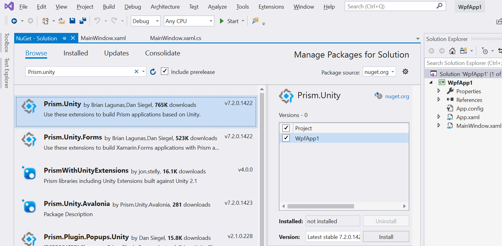
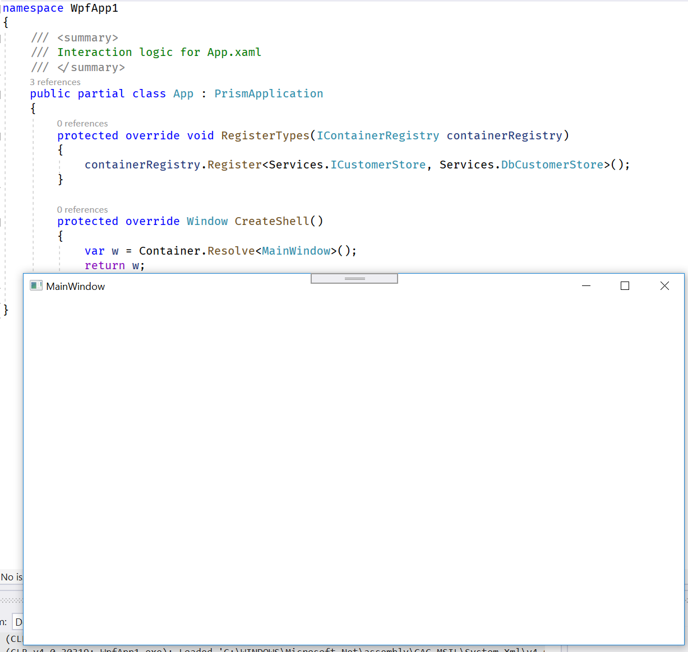
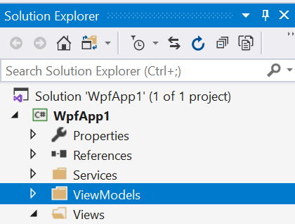

# 开始使用

开始使用 Prism 非常简单。按照以下步骤操作，您将启动一个模块化且易于维护的应用程序，从而快速启动并运行。

> 本指南假定您对 WPF 应用程序项目的结构有一定的了解，并且对 C# 有一定的了解。了解 Model-View-ViewModel （MVVM） 模式很有帮助，WPF 也很容易使用该模式。如果你不是，可以考虑先花点时间做一些研究。

## 安装 Nuget 包

在 Visual Studio 中创建全新的 WPF 应用程序。接下来是安装相应的 nuget 包。此时，需要做出选择，即使用哪个容器来管理依赖项。就本文档而言，Unity 将是首选容器。请参阅下面的可用列表。

| Package | Container | Version |
|---------|-----------|---------|
| Prism.Unity   | [Unity](https://github.com/unitycontainer/unity) | 5.11.1 |
| Prism.DryIoc  | [DryIoc](https://github.com/dadhi/DryIoc)        | 4.0.7  |

> 注意：无需显式安装任何其他依赖项。安装上述软件包之一还将负责安装容器的软件包以及共享的 Prism 软件包。



## 重写现有应用程序对象

入门的下一步是将新创建的 WPF 项目中包含的 Application 对象子类化。导航到 Prism 类 ```App.xaml``` 并将标准 WPF Application 类替换为 Prism ```PrismApplication``` 类。

```xml
<prism:PrismApplication
    x:Class="WpfApp1.App"
    xmlns="http://schemas.microsoft.com/winfx/2006/xaml/presentation"
    xmlns:x="http://schemas.microsoft.com/winfx/2006/xaml"
    xmlns:local="clr-namespace:WpfApp1"
    xmlns:prism="http://prismlibrary.com/">
    <Application.Resources>
    </Application.Resources>
</prism:PrismApplication>
```

在上面的代码片段中，请注意，已添加第 6 行来定义命名空间，并且 App 对象已更新为派生自 ```PrismApplication``` 。接下来，导航到 ```app.xaml.cs``` 代码隐藏文件并更新类定义。

> 不要忘记从 ```PrismApplication``` 代码中删除该 ```StartupUri``` 属性。否则，您最终将获得两个窗口实例。


```cs
using System;
using System.Collections.Generic;
using System.Configuration;
using System.Data;
using System.Linq;
using System.Threading.Tasks;
using System.Windows;
using Prism.Unity;

namespace WpfApp1
{
    public partial class App : PrismApplication
    {
    }
}
```

```PrismApplication``` 必须首先实现一对定义的抽象方法：RegisterTypes 和 CreateShell。

### RegisterTypes

此函数用于注册任何应用依赖项。例如，可能有一个接口用于从某种持久性存储中读取客户数据，并且它的实现是使用某种类型的数据库。它可能看起来像这样：

```cs
public interface ICustomerStore
{
    List<string> GetAll();
}

public class DbCustomerStore : ICustomerStore
{
    public List<string> GetAll()
    {
        // return list from db
    }
}
```

应用中的对象，例如视图模型，如果依赖于客户数据，则需要一个 ```ICustomerStore``` 对象。在 ```App.RegisterTypes``` 函数中，每次对象依赖于 ```ICustomerStore``` 时，都会注册以创建一个 ```DbCustomerStore``` 。

```cs
protected override void RegisterTypes(IContainerRegistry containerRegistry)
{
    containerRegistry.Register<Services.ICustomerStore, Services.DbCustomerStore>();
    // register other needed services here
}
```

> IContainerRegistry 还具有用于针对接口注册的其他函数。 ```RegisterInstance``` 将针对接口注册对象的已创建实例。实际上，注册接口的实现是单例的。一种类似的方法是 ```RegisterSingleton``` 在创建依赖项时创建单个实例，而不是在创建依赖项之前创建单个实例。应该注意的是， ```Container``` 也可以在没有事先注册的情况下解析具体类型。

### CreateShell

必须实现的第二个方法是 CreateShell 方法。这是将创建应用程序主窗口的方法。App 类的 Container 属性应用于创建窗口，因为它会处理任何依赖项。

```cs
public partial class App : PrismApplication
{
    // RegisterTypes function is here

    protected override Window CreateShell()
    {
        var w = Container.Resolve<MainWindow>();
        return w;
    }
}
```

此时，可以生成并运行应用，并应如下所示：



这现在是一个 Prism 应用程序。这里还没有太多内容，但 Prism 可以提供帮助，例如将应用程序分解为可管理的块、导航和实现 MVVM 模式。

## View Models

WPF 设置良好，可以使用 MVVM 模式，而 Prism 对此有很大帮助。它有一个基类，用于处理将更改从视图模型发布到视图的 INotifyPropertyChanged 基础结构。还有一些其他类可以简化从视图模型中处理按钮，而不是在后面的代码中编写事件处理程序。

首先，需要向视图添加一些控件。转到 ```MainWindow.xaml``` 并添加以下 ```<Grid>``` 标记作为 ```<MainWindow>``` 。

```xml
    <Grid>
        <Grid.RowDefinitions>
            <RowDefinition Height="*" />
            <RowDefinition Height="Auto" />
        </Grid.RowDefinitions>

        <ListView
            ItemsSource="{Binding Customers}"
            SelectedItem="{Binding SelectedCustomer}"
        />
        <Button
            Grid.Row="1" Width="80" Height="40"
            Command="{Binding CommandLoad}"
            Content="LOAD"
        />
    </Grid>
```

上面将添加一个新的列表视图，该视图将显示客户名称列表和一个用于加载列表的按钮。

> 要记住的重要一点是，每次出现 ```Binding``` 时，都会链接到此视图的视图模型。

为了帮助完成入门指南的这一部分，需要在项目中设置上面显示的服务。在项目的根目录中，创建一个 ```Services``` 文件夹。在该文件夹中，创建 ```CustomerStore.cs``` 文件并添加以下代码：

```cs
    public interface ICustomerStore
    {
        List<string> GetAll();
    }

    public class DbCustomerStore : ICustomerStore
    {
        public List<string> GetAll()
        {
            return new List<string>()
            {
                "cust 1",
                "cust 2",
                "cust 3",
            };
        }
    }

```

在 ```App.xaml.cs``` 文件中，确保 ```RegisterTypes``` 包含以下行：

```cs
    containerRegistry.Register<Services.ICustomerStore, Services.DbCustomerStore>();
```

## 创建 View Model

首先，在项目的根级别，创建一个名为 ```ViewModels``` 的文件夹。请使用该确切名称，因为稍后在讨论视图模型解析时将需要该名称。



在 ```ViewModels``` 文件夹中，创建了一个名为 ```MainWindowViewModel``` 的类。使用该确切名称的原因将在后面显示。Prism 有一个名为 ```BindableBase``` 的类，该类用作所有视图模型的基础，并将 ```MainWindowViewModel``` 从该类中细分。

```cs
using Prism.Commands;
using Prism.Mvvm;
using System;
using System.Collections.Generic;
using System.Collections.ObjectModel;
using System.Diagnostics;
using System.Linq;
using System.Text;
using System.Threading.Tasks;

namespace WpfApp1.ViewModels
{
    public class MainWindowViewModel : BindableBase
    {
        private Services.ICustomerStore _customerStore = null;

        public MainWindowViewModel(Services.ICustomerStore customerStore)
        {
            _customerStore = customerStore;
        }


        public ObservableCollection<string> Customers { get; private set; } =
            new ObservableCollection<string>();


        private string _selectedCustomer = null;
        public string SelectedCustomer
        {
            get => _selectedCustomer;
            set
            {
                if (SetProperty<string>(ref _selectedCustomer, value))
                {
                    Debug.WriteLine(_selectedCustomer ?? "no customer selected");
                }
            }
        }

        private DelegateCommand _commandLoad = null;
        public DelegateCommand CommandLoad =>
            _commandLoad ?? (_commandLoad = new DelegateCommand(CommandLoadExecute));

        private void CommandLoadExecute()
        {
            Customers.Clear();
            List<string> list = _customerStore.GetAll();
            foreach (string item in list)
                Customers.Add(item);
        }
    }
}
```

对这里发生的事情进行一些解释。MainWindowViewModel 依赖于 ```ICustomerStore``` 接口，因此必须在 中注册该接口， ```App.RegisterTypes``` 以便依赖项容器可以处理其实现。有一个 ```Customers``` 属性绑定到用户界面中的列表视图，还有一个 ```SelectedCustomer``` 属性绑定到列表视图中的当前选定项。

还有实现 ```ICommand``` 接口的 CommandLoad 对象。这有一个方法，当用户单击按钮时调用该 ```Execute``` 方法。Prism 使用 ```DelegateCommand``` 类实现 ```ICommand``` 接口，该类允许传入委托以处理接口的 ```ICommand``` 实现。在 的情况下 ```CommandLoad``` ，该 ```CommandLoadExecute``` 函数作为委托传入，现在，每当 WPF 绑定系统尝试执行 ```ICommand.Execute``` 时 ```CommandLoadExecute``` ，都会调用 。

有关 DelegateCommand 的更多详细信息，请参阅 [Commanding](xref:Commands.Commanding)。

### 使用 ViewModelLocator

现在有一个 View 和一个 ViewModel，但它们是如何链接在一起的呢？开箱即用，Prism 有一个 ```ViewModelLocator``` 使用约定来确定视图模型的正确类，使用其依赖项实例化它并将其附加到视图的 ``DataContext`` 中。

默认约定是将所有视图放在 ```Views``` 文件夹中，将视图模型放在文件夹中 ```ViewModels``` 。

- ```WpfApp1.Views.MainWindow``` => ```WpfApp1.ViewModels.MainWindowViewModel```
- ```WpfApp1.Views.OtherView``` => ```WpfApp1.ViewModels.OtherViewModel```

这是可配置的，可以添加不同的分辨率逻辑。

为此， ```View``` 和 ```ViewModel``` 必须正确位于其正确的名称空间中。下面是它的屏幕截图：


单机 [此处](xref:Mvvm.ViewModelLocator) 了解有关 ```ViewModelLocator```。

如果出于某种原因不想使用此功能，则必须在视图中选择退出。可以在 XAML 中按如下方式管理此内容：

```xml
<Window
    ...
    xmlns:prism="http://prismlibrary.com/"
    prism:ViewModelLocator.AutoWireViewModel="False"
    >

	<!-- ui controls here -->
</Window>
```
