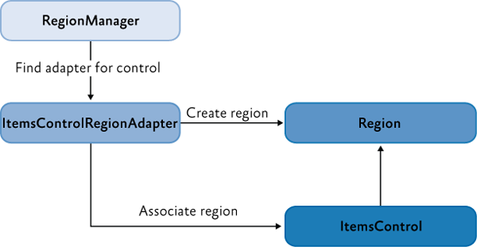
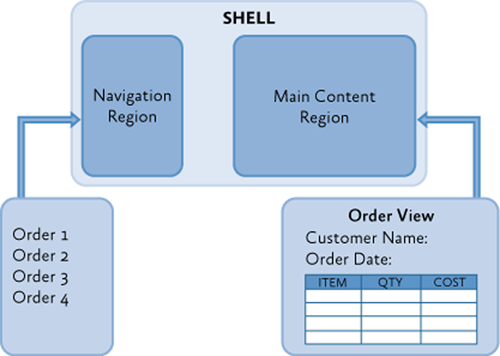
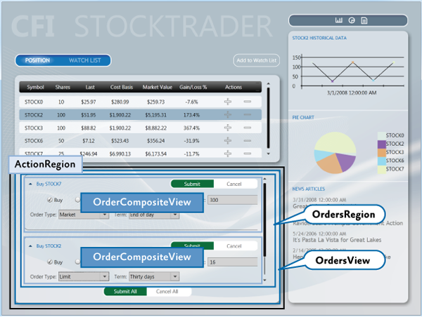
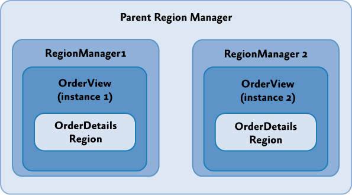

# 使用 WPF 的 Prism 库编写用户界面

复合应用程序用户界面 （UI） 由松散耦合的可视组件（称为 **视图** ）组成，这些组件通常包含在应用程序模块中，但它们不需要。如果将应用程序划分为多个模块，则需要某种方法来松散地组合 UI，但即使视图不在模块中，也可以选择使用此方法。对于用户来说，该应用程序提供了无缝的用户体验，并提供了一个完全集成的应用程序。

若要编写 UI，需要一种体系结构，该体系结构允许您创建由运行时生成的松散耦合的视觉元素组成的布局。此外，架构应为这些视觉元素提供以松散耦合方式进行通信的策略。

可以使用以下范例之一生成应用程序 UI：

- 窗体的所有必需控件都包含在单个可扩展应用程序标记语言 （**XAML**） 文件中，在设计时组成窗体。
- 窗体的逻辑区域被分成不同的部分，通常是用户控件。部件由窗体引用，窗体在设计时组成。
- 窗体的逻辑区域被分成不同的部分，通常是用户控件。这些部件对窗体是未知的，并在运行时动态添加到窗体中。使用此方法的应用程序称为使用 UI 组合模式的复合应用程序。

下面是一个应用程序的图片。它是通过将来自不同模块的多个视图加载到 shell 公开的区域中来组成的，如下图所示。


## UI 布局概念

```shell``` 通常是应用程序主窗口，它由区域组成。区域大多包含在 ```ContentControl```, ```ItemControl``` 和 ```TabControl``` 中, 而shell对 ```region``` 内实现的内容不知情。 ```region```内部是视图。视图是UI的一个特定部分的实现，并且与应用程序的其他部分解耦。

以下各节介绍复合应用程序开发的高级核心概念。

### Shell

shell 是包含主要 UI 内容的应用程序根对象。在 Windows Presentation Foundation （WPF） 应用程序中，shell 是 ```Window``` 对象。

shell 扮演母版页的角色，为应用程序提供布局结构。shell 包含一个或多个命名区域，模块可以在其中指定将显示的视图。它还可以定义某些顶级 UI 元素，例如背景、主菜单和工具栏。

shell 定义应用程序的整体外观。它可以定义 shell 布局本身中存在和可见的样式和边框，还可以定义将应用于插入 shell 的视图的样式、模板和主题。

通常，shell 是 WPF 应用程序项目的一部分。包含 shell 的程序集可能引用也可能不引用包含要在 shell 区域中加载的视图的程序集。

### Views

视图是复合应用程序中 UI 构造的主要单元。可以将视图定义为用户控件、页面、数据模板或自定义控件。视图封装了 UI 的一部分，您希望将其与应用程序的其他部分尽可能地分离。您可以根据封装或某个功能选择视图中的内容，也可以选择将某些内容定义为视图，因为应用程序中将有该视图的多个实例。

由于 WPF 的内容模型，定义视图不需要特定于 Prism 库的内容。定义视图的最简单方法是定义用户控件。若要将视图添加到 UI，只需一种方法来构造它并将其添加到容器中。WPF 提供了执行此操作的机制。Prism 库增加了定义可在运行时动态添加视图的区域的功能。

#### Composite Views

支持特定功能的视图可能会变得复杂。在这种情况下，您可能希望将视图划分为多个子视图，并让父视图通过将子视图用作部件来处理自身构造。应用程序可能在设计时静态执行此操作，也可能支持在运行时通过包含的区域添加模块视图。如果视图未在单个视图类中完全定义，则可以将其称为复合视图。在许多情况下，复合视图负责构造子视图并协调它们之间的交互。您可以使用 Prism Library 命令和事件聚合器设计与其同级视图及其父复合视图更松散耦合的子视图。

### Regions

通过区域管理器、区域和区域适配器在 Prism Library 中启用区域。

#### Region Manager

```RegionManager``` 类负责创建和维护宿主控件的区域集合。 ```RegionManager``` 使用特定于控件的适配器，该适配器将新区域与主机控件相关联。下图显示了 ```RegionManager``` 设置的区域、控件和适配器之间的关系。



可以在 ```RegionManager``` 代码或 XAML 中创建区域。 ```RegionManager.RegionName``` 附加属性用于通过将附加属性应用于宿主控件，在 XAML 中创建区域。

应用程序可以包含 ```RegionManager``` .您可以指定要将区域注册到的 ```RegionManager``` 实例。如果要在可视化树中移动控件，并且不希望在删除附加属性值时清除该区域，这将非常有用。

```RegionManager``` 提供了一个 RegionContext 附加属性，该属性允许其区域共享数据。

#### Region Implementation

区域是实现接口的 ```IRegion``` 类。术语“区域”表示可以保存 UI 中呈现的动态数据的容器。区域允许 Prism Library 将模块中包含的动态内容放置在 UI 容器的预定义占位符中。

区域可以包含任何类型的 UI 内容。模块可以包含以用户控件形式呈现的 UI 内容、与数据模板关联的数据类型、自定义控件或这些内容的任意组合。这允许您定义 UI 区域的外观，然后让模块将内容放置在这些预定区域中。

一个区域可以包含零个或多个项目。根据区域所管理的主机控件的类型，一个或多个项目可能可见。例如，一个 ```ContentControl``` 只能显示单个对象。但是，它所在的区域可以包含许多项目，并且 ```ItemsControl``` 可以显示多个项目。这允许区域中的每个项目在 UI 中可见。

在下图中，示例应用 shell 包含四个区域： **MainRegion** 、 **MainToolbarRegion** 、 **ResearchRegion** 和 **ActionRegion** 。这些区域由应用程序中的各个模块填充，内容可以随时更改。


##### 模块用户控制到区域映射

若要演示模块和内容如何与区域关联，请参见下面的插图。它显示了 ```WatchModule``` 和 ```NewsModule``` 如何与外壳中的相应区域关联。

**MainRegion** 包含 ```WatchListView``` 用户控件，该控件包含在 ```WatchModule``` 中， **ResearchRegion** 还包含 ```ArticleView``` 用户控件，该控件包含在 ```NewsModule``` 。

在使用 Prism 库创建的应用程序中，此类映射将成为设计过程的一部分，因为设计人员和开发人员使用它们来确定建议在特定区域中放置的内容。这允许设计人员确定所需的总空间以及必须添加的任何其他项目，以确保内容在允许的空间中可见。


#### 默认区域功能

虽然您不需要完全了解区域实现即可使用它们，但了解控件和区域的关联方式以及默认区域功能可能会很有用：例如，区域如何定位和实例化视图，如何在视图为活动视图时通知视图，或者视图生存期如何与激活相关联。

以下各节介绍区域适配器和区域行为。

##### Region Adapter

若要将 UI 控件公开为区域，它必须具有区域适配器。区域适配器负责创建区域并将其与控件关联。这允许您使用界面 ```IRegion``` 以一致的方式管理 UI 控件内容。每个区域适配器都采用特定类型的 UI 控件。Prism Library 提供以下三个区域适配器：

- ```ContentControlRegionAdapter```. 此适配器调整类型 ```System.Windows.Controls.ContentControl``` 和派生类的控件。
- ```SelectorRegionAdapter```. 此适配器调整派生自类 ```System.Windows.Controls.Primitives.Selector``` 的控件，例如控件 ```System.Windows.Controls.TabControl``` 。
- ```ItemsControlRegionAdapter```. 此适配器调整类型 ```System.Windows.Controls.ItemsControl``` 和派生类的控件。

##### Region Behaviors

Prism Library 介绍了区域行为的概念。这些是可插拔组件，可为区域提供大部分功能。引入了区域行为以支持视图发现和区域上下文（本主题稍后将介绍）。此外，行为还提供了一种扩展区域实现的有效方法。

区域行为是附加到区域的类，用于为区域提供附加功能。此行为附加到该区域，并在该区域的生存期内保持活动状态。例如，当一个 ```AutoPopulateRegionBehavior``` 附加到某个区域时，它会自动实例化并添加针对具有该名称的区域注册的任何 ```ViewTypes``` 内容。在该地区的整个生命周期内，它会持续监控新注册。 ```RegionViewRegistry``` 在系统范围或每个区域的基础上，可以轻松添加自定义区域行为或替换现有行为。

接下来的部分将介绍自动添加到所有区域的默认行为。一种行为 ```SelectorItemsSourceSyncBehavior``` ， 仅附加到派生自 的 ```Selector``` 控件。

##### Registration Behavior

负责 ```RegionManagerRegistrationBehavior``` 确保将区域注册到正确的 ```RegionManager``` .当视图或控件作为另一个控件或区域的子项添加到可视化树时，控件中定义的任何区域都应注册到父控件的视图或控件中 ```RegionManager``` 。删除子控件时，已注册的区域将未注册。

##### Auto-Population Behavior

有两个类负责实现视图发现。其中之一是 ```AutoPopulateRegionBehavior``` .当它附加到区域时，它会检索在区域名称下注册的所有视图类型。然后，它会创建这些视图的实例，并将它们添加到区域中。创建区域后，将 ```AutoPopulateRegionBehavior``` 监视 ```RegionViewRegistry``` 该区域名称的任何新注册视图类型。

如果要更好地控制视图发现过程，请考虑创建自己的 ```IRegionViewRegistry``` 和 ```AutoPopulateRegionBehavior``` 的实现。

##### Region Context Behaviors

区域上下文功能包含在两个行为中： ```SyncRegionContextWithHostBehavior``` 和 ```BindRegionContextToDependencyObjectBehavior``` 。这些行为负责监视对区域上所做的上下文更改，然后将上下文与附加到视图的上下文依赖项属性同步。

##### Activation Behavior

负责 ```RegionActiveAwareBehavior``` 通知视图是处于活动状态还是非活动状态。视图必须实现 ```IActiveAware``` 才能接收这些更改通知。此活动感知通知是单向的（它从行为传输到视图）。视图不能通过更改 ```IActiveAware``` 接口上的活动属性来影响其活动状态。

##### Region Lifetime Behavior

负责 ```RegionMemberLifetimeBehavior``` 确定在停用项目时是否应将其从区域中删除。监视 ```RegionMemberLifetimeBehavior``` 区域 ```ActiveViews``` 的集合，以发现过渡到停用状态的项目。该行为检查已删除的项目 ```IRegionMemberLifetime``` 或 ```RegionMemberLifetimeAttribute``` （按该顺序）以确定是否应在删除时保持活动状态。

如果集合中的项是一个 ```System.Windows.FrameworkElement``` ，它还会检查其 ```DataContext``` 是否有 ```IRegionMemberLifetime``` 或 ```RegionMemberLifetimeAttribute``` 。

按以下顺序检查区域项目：

1. ```IRegionMemberLifetime.KeepAlive``` value
1. ```DataContext```'s ```IRegionMemberLifetime.KeepAlive``` value
1. ```RegionMemberLifetimeAttribute.KeepAlive``` value
1. ```DataContext```'s ```RegionMemberLifetimeAttribute.KeepAlive``` value

##### Control-Specific Behaviors

仅 ```SelectorItemsSourceSyncBehavior``` 用于派生自 ```Selector``` 的控件，如 WPF 中的选项卡控件。它负责将区域中的视图与选择器的项目同步，然后将区域中的活动视图与选择器的选定项目同步。

#### Extending the Region Implementation

Prism 库提供了扩展点，允许您自定义或扩展所提供 API 的默认行为。例如，您可以编写自己的区域适配器、区域行为或更改导航 API 分析 URI 的方式。

### View Composition

视图组合是视图的构造。在复合应用程序中，来自多个模块的视图必须在运行时显示在应用程序 UI 中的特定位置。为此，您需要定义视图的显示位置，以及如何在这些位置创建和显示视图。

可以通过视图发现自动创建视图并显示视图，也可以通过视图注入以编程方式创建视图并显示视图。这两种技术决定了如何将各个视图映射到应用程序 UI 中的命名位置。

#### View Discovery

在视图发现中，您可以在区域名称和视图类型 ```RegionViewRegistry``` 之间建立关系。创建区域时，该区域会查找与该区域 ```ViewTypes``` 关联的所有视图，并自动实例化和加载相应的视图。因此，使用视图发现时，您无法显式控制何时加载和显示与区域对应的视图。

#### View Injection

在视图注入中，代码获取对区域的引用，然后以编程方式将视图添加到其中。通常，这是在模块初始化或作为用户操作的结果时完成的。您的代码将按名称查询特定区域， ```RegionManager``` 然后将视图注入其中。通过视图注入，您可以更好地控制何时加载和显示视图。您还可以从该区域移除视图。但是，使用视图注入时，无法将视图添加到尚未创建的区域。

#### Navigation

Prism Library 8 包含导航 API。导航 API 允许您将区域导航到 URI，从而简化视图注入过程。导航 API 实例化视图，将其添加到区域，然后激活它。此外，导航 API 允许导航回区域中包含的先前创建的视图。有关导航 API 的更多信息，请参阅 [Basic Region Navigation](xref:Navigation.Regions.GettingStarted).

#### 何时使用视图发现与视图注入

选择要用于某个区域的视图加载策略取决于应用程序要求和该区域的功能。

在以下情况下使用视图发现：

- 需要或需要自动加载视图。
- 视图的单个实例将加载到该区域中。

在以下情况下使用视图注入：

- 应用程序使用导航 API。
- 您需要对何时创建和显示视图进行显式或编程控制，或者需要从区域中删除视图;例如，作为应用程序逻辑或导航的结果。
- 您需要在一个区域中显示同一视图的多个实例，其中每个视图实例绑定到不同的数据。
- 您需要控制将视图添加到区域的哪个实例。例如，您希望将客户详细信息视图添加到特定的客户详细信息区域。(此方案需要实现作用域内区域，如本主题后面所述。)

## UI 布局方案

在复合应用程序中，来自多个模块的视图在运行时显示在应用程序 UI 中的特定位置。为此，您需要定义视图的显示位置，以及如何在这些位置创建和显示视图。

视图与 UI 中显示视图的位置分离后，应用程序的外观和布局可以独立于区域中显示的视图而发展。

接下来的部分介绍在开发复合应用程序时将遇到的核心方案。

### Implementing the Shell

shell 是包含主 UI 内容的应用程序根对象。在 WPF 应用程序中，shell 是 ```Window``` 对象。

shell 可以包含命名区域，模块可以在其中指定将显示的视图。它还可以定义某些顶级 UI 元素，例如主菜单和工具栏。shell 定义应用程序的整体结构和外观，类似于 ASP.NET 母版页控件。它可以定义 shell 布局本身中存在和可见的样式和边框，还可以定义应用于插入 shell 的视图的样式、模板和主题。

您无需在应用程序体系结构中具有单独的 shell 即可使用 Prism 库。如果要构建一个全新的复合应用程序，则实现 shell 会提供明确定义的根和初始化模式，用于设置应用程序的主 UI。但是，如果要向现有应用程序添加棱镜库功能，则无需更改应用程序的基本体系结构即可添加 shell。相反，您可以更改现有的窗口定义或控件，以添加可以根据需要拉取视图的区域。

应用程序中还可以有多个 shell。如果应用程序设计为用户打开多个顶级窗口，则每个顶级窗口都充当其包含的内容的 shell。

#### Sample Shell

此示例将 shell 作为其主窗口。在下图中，突出显示了 shell 和视图。shell 是应用程序启动时显示的主窗口，其中包含所有视图。它定义了模块将其视图添加到其中的区域和几个顶级 UI 项，包括标题和监视列表撕下横幅。


应用中的 shell 实现由 Shell.xaml、其代码隐藏文件Shell.xaml.cs及其视图模型ShellViewModel.cs提供。Shell.xaml 包括作为 shell 一部分的布局和 UI 元素，包括模块向其添加视图的区域的定义。

以下 XAML 显示了定义 shell 的结构和主要 XAML 元素。请注意， ```RegionName``` 附加属性用于定义四个区域，窗口背景图像为 shell 提供背景。

```xml
<!--Shell.xaml (WPF) -->
<Window x:Class="StockTraderRI.Shell">

    <!--shell background -->
    <Window.Background>
        <ImageBrush ImageSource="Resources/background.png" Stretch="UniformToFill"/>
    </Window.Background>

    <Grid>

        <!-- logo -->
        <Canvas x:Name="Logo" ...>
            <TextBlock Text="CFI" ... />
            <TextBlock Text="STOCKTRADER" .../>
        </Canvas>

        <!-- main bar -->
        <ItemsControl 
            x:Name="MainToolbar"
            prism:RegionManager.RegionName="{x:Static inf:RegionNames.MainToolBarRegion}"/>

        <!-- content -->
        <Grid>
            <Controls:AnimatedTabControl
                x:Name="PositionBuySellTab"
                prism:RegionManager.RegionName="{x:Static inf:RegionNames.MainRegion}"/>
        </Grid>

        <!-- details -->
        <Grid>
            <ContentControl
                x:Name="ActionContent"
                prism:RegionManager.RegionName="{x:Static inf:RegionNames.ActionRegion}"/>
        </Grid>

        <!-- sidebar -->
        <Grid x:Name="SideGrid">
            <Controls:ResearchControl
                prism:RegionManager.RegionName="{x:Static inf:RegionNames.ResearchRegion}" />
        </Grid>

    </Grid>
</Window>
```

``Shell`` 代码隐藏文件的实现非常简单。导出 ， ```Shell``` 以便在创建 ```App``` 对象时添加其依赖项。

```cs
// Shell.xaml.cs
[Export]
public partial class Shell : Window
{
    public Shell()
    {
        InitializeComponent();
    }
}
```

代码隐藏文件中的最小代码说明了复合应用程序体系结构的强大功能和简单性，以及 shell 与其组成视图之间的松散耦合。

### 定义 Regions

您可以通过定义具有命名位置（称为区域）的布局来定义视图的显示位置。区域充当将在运行时显示的一个或多个视图的占位符。模块可以在布局中查找和添加内容，而无需知道区域的显示方式和位置。这允许更改布局，而不会影响将内容添加到布局的模块。

通过在 XAML 中将区域名称分配给 WPF 控件来定义区域，如前面的 Shell.xaml 文件或代码中所示。可以通过区域名称访问区域。在运行时，视图将添加到命名的 Region 控件中，然后该控件根据视图实现的布局策略显示一个或多个视图。例如，选项卡控件区域将以选项卡式排列方式布局其子视图。区域支持添加或删除视图。可以通过编程或自动方式在区域中创建和显示视图。在棱镜库中，前者是通过视图注入实现的，后者是通过视图发现实现的。这两种技术确定如何将各个视图映射到应用程序 UI 中的命名区域。

应用程序的 shell 在最高级别定义应用程序布局;例如，通过指定主要内容和导航内容的位置，如下图所示。这些高级视图中的布局也以类似的方式定义，允许以递归方式组合整个 UI。



区域有时用于定义逻辑上相关的多个视图的位置。在此方案中，区域控件通常是一个 ```ItemsControl``` 派生控件，它将根据其实现的布局策略（如在堆叠或选项卡式布局排列中）显示视图。

区域还可用于定义单个视图的位置;例如，通过使用 ```ContentControl``` .在此方案中，区域控件一次只显示一个视图，即使多个视图映射到该区域位置也是如此。

#### App Shell Regions 示例


当应用程序买入或卖出股票时，示例应用程序 UI 中还会演示多视图布局。“买入/卖出”区域是一个列表样式区域，显示多个买入/卖出视图 （**OrderCompositeView**） 作为其列表的一部分，如下图所示。



shell 的 **ActionRegion** 包含 **OrdersView** **。OrdersView** 包含“全部提交”和“全部取消”按钮以及 **OrdersRegion** **。OrdersRegion** 附加到一个 **ListBox** 控件，该控件显示多个 **OrderCompositeViews** 。

#### 在 XAML 中添加 Region

区域是实现接口的 ```IRegion``` 类。区域是保存控件要显示的内容的容器。

它 ```RegionManager``` 提供了一个附加属性，可用于在 XAML 中创建简单的区域。若要使用附加属性，必须将 Prism Library 命名空间加载到 XAML 中，然后使用 ```RegionName``` 附加属性。下面的示例演示如何在带有 ```AnimatedTabControl``` 。

请注意，使用 ```x:Static``` 标记扩展来引用 ```MainRegion``` 字符串常量。这种做法消除了 XAML 中的魔术字符串。

```xml
<!-- (WPF) -->
<Controls:AnimatedTabControl 
    x:Name="PositionBuySellTab"
    prism:RegionManager.RegionName="{x:Static inf:RegionNames.MainRegion}"/>
```

#### 使用代码添加 Region

可以直接注册区域， ```RegionManager``` 而无需使用 XAML。下面的代码示例演示如何从代码隐藏文件向控件添加区域。首先，获取对区域管理器的引用。然后，使用 ```RegionManager``` 静态方法 ```SetRegionManager``` 和 ```SetRegionName``` 将区域附加到 UI的 ```ActionContent``` 的控件，然后将该区域命名为 ```ActionRegion``` 。

```cs
IRegionManager regionManager = ServiceLocator.Current.GetInstance<IRegionManager>();
RegionManager.SetRegionManager(this.ActionContent, regionManager);
RegionManager.SetRegionName(this.ActionContent, "ActionRegion");
```

### 加载区域时显示区域中的视图

使用视图发现方法，模块可以注册特定命名位置的视图（视图模型或表示模型）。在运行时显示该位置时，将自动创建已为该位置注册的任何视图，并在其中显示。

模块将视图注册到注册表。父视图查询此注册表以发现为命名位置注册的视图。发现这些视图后，父视图会通过将这些视图添加到占位符控件来将这些视图放在屏幕上。

加载应用程序后，将通知复合视图处理已添加到注册表的新视图的放置。

下图显示了视图发现方法。


Prism Library 定义了一个标准注册表 ```RegionViewRegistry``` ，用于注册这些命名位置的视图。

若要在区域中显示视图，请向区域管理器注册该视图，如下面的代码示例所示。您可以直接向区域注册视图类型，在这种情况下，视图将由依赖项注入容器构造，并在加载托管该区域的控件时添加到该区域。

```cs
// View discovery
this.regionManager.RegisterViewWithRegion("MainRegion", typeof(EmployeeView));
```

（可选）您可以提供返回要显示的视图的委托，如下一个示例所示。创建区域时，区域管理器将显示视图。

```cs
// View discovery
this.regionManager.RegisterViewWithRegion("MainRegion", () => this.container.Resolve<EmployeeView>());
```

### 以编程方式显示区域中的视图

在视图注入方法中，管理视图的模块以编程方式在命名位置添加视图或从命名位置删除视图。若要启用此功能，应用程序在 UI 中包含命名位置的注册表。模块可以使用注册表查找其中一个位置，然后以编程方式将视图注入其中。为了确保可以以类似方式访问注册表中的位置，每个命名位置都遵循用于注入视图的通用接口。下图显示了视图注入方法。


Prism Library 定义了一个标准注册表 ```RegionManager``` 和一个标准接口 ```IRegion``` ，用于访问这些位置。

若要使用视图注入将视图添加到区域，请从区域管理器获取该区域，然后调用该 ```Add``` 方法，如以下代码所示。使用视图注入时，仅在将视图添加到区域后才会显示视图，这可能在加载模块或用户操作完成预定义操作时发生。

```cs
// View injection
IRegion region = regionManager.Regions["MainRegion"];

var ordersView = container.Resolve<OrdersView>();
region.Add(ordersView, "OrdersView");
region.Activate(ordersView);
```

#### 对区域中的视图进行排序

无论是使用视图发现还是视图注入，应用程序都可能需要对视图在 ```TabControl``` 、 ```ItemsControl``` 或显示多个活动视图的任何其他控件中的显示方式进行排序。默认情况下，视图按注册和添加到区域中的顺序显示。

构建复合应用程序时，通常会从不同的模块注册视图。声明模块之间的依赖关系可以帮助缓解问题，但是当模块和视图没有任何真正的相互依赖关系时，声明人为依赖关系会不必要地耦合模块。

为了允许视图参与排序，棱镜库提供了该 ```ViewSortHint``` 属性。此属性包含一个字符串 ```Hint``` 属性，该属性允许视图声明在区域中应如何排序的提示。

显示视图时，该 ```Region``` 类使用默认视图排序例程，该例程使用提示对视图进行排序。这是一种简单的区分大小写的序数排序。具有排序提示属性的视图将排在前于没有排序提示属性的视图之前。此外，没有该属性的属性将按添加到区域的顺序显示。

如果要更改视图的排序方式，该 ```Region``` 类提供了一个属性，您可以使用自己的 ```Comparison<_object_>``` 委托方法设置该 ```SortComparison``` 属性。请务必注意，区域 ```Views``` 和 ```ActiveViews``` 属性的顺序反映在 UI 中，因为适配器（如 ```ItemsControlRegionAdapter``` ）直接绑定到这些属性。自定义区域适配器可以实现自己的排序和筛选器，这些排序和筛选器将覆盖区域对视图进行排序的方式。

### 在多个区域之间共享数据

Prism Library 提供了多种在视图之间进行通信的方法，具体取决于您的方案。区域管理器 ```RegionContext``` 提供属性作为这些方法之一。

```RegionContext``` 当您想要在父视图和区域中托管的子视图之间共享上下文时，非常有用。 ```RegionContext``` 是附加属性。在区域控件上设置上下文的值，以便该上下文可用于该区域控件中显示的所有子视图。区域上下文可以是任何简单或复杂对象，也可以是数据绑定值。 ```RegionContext``` 可以与视图发现或视图注入一起使用。

>**注意:** WPF 中的 ```DataContext``` 属性用于设置视图的本地数据上下文。它允许视图使用数据绑定与视图模型、本地演示器或模型进行通信。 ```RegionContext``` 用于在多个视图之间共享上下文，而不是单个视图的本地上下文。它提供了一种在多个视图之间共享上下文的简单机制。

下面的代码演示如何在 XAML 中使用 ```RegionContext``` 附加属性。

```xml
<TabControl AutomationProperties.AutomationId="DetailsTabControl" 
    prism:RegionManager.RegionName="{x:Static local:RegionNames.TabRegion}"
    prism:RegionManager.RegionContext="{Binding Path=SelectedEmployee.EmployeeId}"
...>
```

还可以使用代码设置 ```RegionContext``` ，如以下示例所示。

```cs
RegionManager.Regions["Region1"].Context = employeeId;
```

若要检索视图中的 ```RegionContext``` ，请使用 ```RegionContext``` 类的 ```GetObservableContext``` 静态方法。它将视图作为参数传递，然后访问其 ```Value``` 属性，如下面的代码示例所示。

```cs
private void GetRegionContext()
{
    this.Model.EmployeeId = (int)RegionContext.GetObservableContext(this).Value;
}
```

只需将新值分配给视图 ```Value``` 的属性，即可从视图中更改 的 ```RegionContext``` 值。视图可以选择 ```RegionContext``` 通过订阅 ```GetObservableContext``` 该方法返回 ```PropertyChanged``` 的事件 ```ObservableObject``` 来接收更改的通知。这允许多个视图在更改时 ```RegionContext``` 保持同步。下面的代码示例演示如何订阅该 ```PropertyChanged``` 事件。

```cs
ObservableObject<object> viewRegionContext = 
                RegionContext.GetObservableContext(this);
viewRegionContext.PropertyChanged += this.ViewRegionContext_OnPropertyChangedEvent;

private void ViewRegionContext_OnPropertyChangedEvent(object sender, 
                    PropertyChangedEventArgs args)

{
    if (args.PropertyName == "Value")
    {
        var context = (ObservableObject<object>) sender;
        int newValue = (int)context.Value;
    }
}
```

>**注意:** 设置为 ```RegionContext``` 区域中托管的内容对象的附加属性。这意味着内容对象必须派生自 ```DependencyObject``` 。在前面的示例中，视图是一个可视化控件，它最终派生自 ```DependencyObject``` 。

>如果选择使用 WPF 数据模板来定义视图，则内容对象将表示 ```ViewModel``` 或 ```PresentationModel``` 。如果视图模型或表示模型需要检索 ```RegionContext``` ，则需要从 ```DependencyObject``` 基类派生。

### 创建区域的多个实例

作用域区域仅通过视图注入可用。如果需要视图具有自己的区域实例，则应使用它们。定义具有附加属性的区域的视图会自动继承其父级的 ```RegionManager``` .通常，这是在 shell 窗口中注册的全局 ```RegionManager``` 。如果应用程序创建该视图的多个实例，则每个实例都将尝试向父 ```RegionManager``` 级注册其区域。 ```RegionManager``` 仅允许唯一命名的区域;因此，第二次注册将产生错误。

相反，请使用作用域区域，以便每个视图都有自己的 ```RegionManager``` 区域，并且其区域将注册到该 ```RegionManager``` 视图而不是父 ```RegionManager``` 级，如下图所示。



若要为视图创建本地 ```RegionManager``` 视图，请指定在将视图添加到区域时应创建一个新 ```RegionManager``` 视图，如下面的代码示例所示。

```cs
IRegion detailsRegion = this.regionManager.Regions["DetailsRegion"];
View view = new View();
bool createRegionManagerScope = true;
IRegionManager detailsRegionManager = detailsRegion.Add(view, null, createRegionManagerScope);
```

该 ```Add``` 方法将返回视图可以保留的新内容 ```RegionManager``` ，以便进一步访问本地范围。
